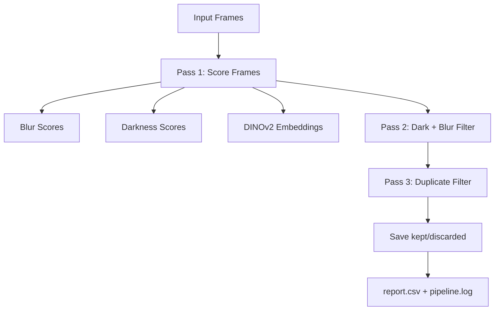

# Task 1 — Video Quality Assessment (Assessment-Ready)

This module processes 360° equirectangular video frames and removes low-quality or redundant frames.

## Objective
- Input: sequential equirectangular frames from 360° capture
- Remove frames that are:
  - Blurry
  - Too dark
  - Near-duplicate

## Pipeline Overview



## Key Design Choice for 360° Data

The full equirectangular frame has strong distortion near poles and can include the camera holder in the bottom strip.
To make decisions stable, all checks run on a shared analysis band:
- Ignore top 20%
- Ignore bottom 20%
- Analyze middle 60%

Use the visualizer to confirm the crop on your capture:

```bash
python visualize_analysis_region.py input/Task1/RLT1746244567461/images/ --output region_viz --samples 12
```

## How to Run

1) Create and activate a virtual environment

```bash
python3 -m venv .venv
source .venv/bin/activate  # macOS/Linux
# .venv\Scripts\activate   # Windows (PowerShell)
```

2) Install dependencies

```bash
pip install -r requirements.txt
```

3) Run the pipeline

```bash
python main.py input/Task1/RLT1746244567461/images/ --output output_test
```

4) Inspect results

```bash
ls output_test/kept
ls output_test/discarded
cat output_test/pipeline.log
```

## Input Data Setup

Put your raw 360° extracted frames inside the `input/` folder (any subfolder structure is fine).

Expected format:

```text
input/
  Task1/
    RLT1746244567461/
      images/
        frame_0001.jpg
        frame_0002.jpg
    RLT1752866201591/
      images/
        frame_0001.jpg
        frame_0002.jpg
```

Then run:

```bash
python main.py input/Task1/<folder_name>/images/ --output output_test/<folder_name>/

python main.py input/Task1/RLT1746244567461/images/ --output output_test/RLT1746244567461/

python main.py input/Task1/RLT1752866201591/images/ --output output_test/RLT1752866201591/

```

Supported image formats: `.jpg`, `.jpeg`, `.png`, `.bmp`, `.webp`.

## Submission Packaging Note

input file path :  https://ml-team-constructn.s3.us-west-2.amazonaws.com/Assignment/Level_1/Task1.zip


For submission, this repository is intentionally packaged as:
- `input/` contains only a few sample images (for structure/example).
- `output_test/<folder_name>/discarded/` is retained.
- `output_test/<folder_name>/kept/` images were removed to reduce attachment size.


- To fully reproduce the exact run, please place the complete task1 image folder in input.
- With only sample input, the pipeline will run, but outputs will match only those samples.

## Output Format

```text
output_test/
  <folder_name>/
    report.csv # list of accepted and discarded frames.
    pipeline.log
    discarded/
    kept/   # empty/removed in shared package
```

## Current Main Parameters

From `config.py`:
- Region mask: `top_crop=0.20`, `bottom_crop=0.20`
- Blur: `abs_blur_threshold=40.0`, `relative_drop=0.50`, `num_patches=10`, `min_sharp_patches=4`
- Darkness: `dark_pixel_ratio=0.60`, `median_brightness=35`, `shadow_ratio=0.80`, `dark_min_conditions=2`
- Duplicate: `flow_threshold=3.0`, `cosine_threshold=0.90`, `flow_downsample=0.25`

## Implementation Map

- `main.py` — orchestration (3-pass pipeline)
- `blur.py` — blur scoring and decisions
- `darkness.py` — darkness scoring and decisions
- `duplicate.py` — optical flow + DINOv2 near-duplicate detection
- `utils/regions.py` — shared analysis crop utilities
- `file_utils.py` — frame I/O and report writing
- `visualize_analysis_region.py` — crop sanity-check previews

## Notes for Evaluators

- Handles equirectangular-specific noise via region masking.
- Uses both classic CV and learned embeddings:
  - CV: Laplacian variance, HSV thresholds, optical flow
  - ML: DINOv2 embeddings with cosine similarity
- Retains the sharpest frame within duplicate clusters.

## Detailed Technical Report

For full theory, math, alternatives (cubemap/projective), and rationale, see:
- `Task1_Assessment_Report.md`

## Reproducible Setup (Any Machine)

From the project folder:

```bash
python3 -m venv .venv
source .venv/bin/activate   # macOS/Linux
pip install --upgrade pip
pip install -r requirements.txt
python main.py input/Task1/RLT1746244567461/images/ --output output_test
```
