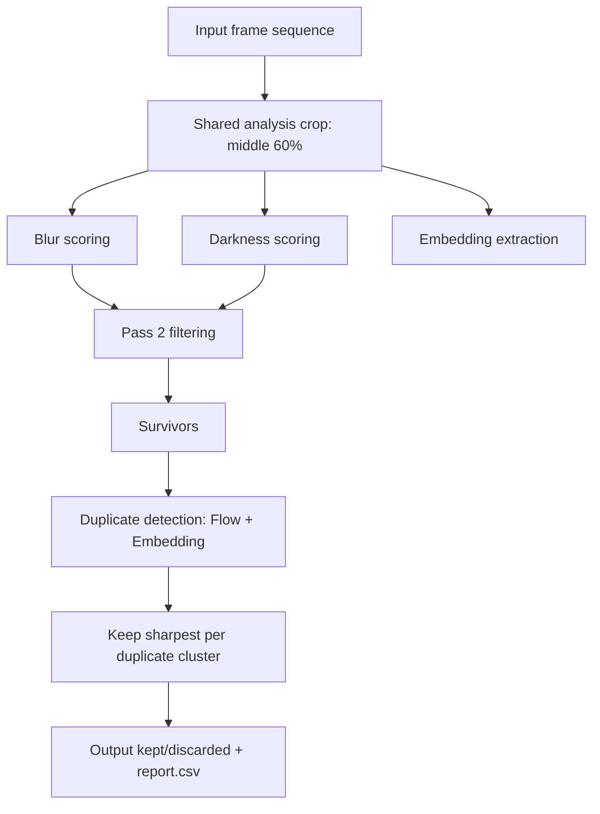

# Task 1 Assessment Report
## Video Quality Assessment for 360° Equirectangular Construction Captures

## 1) Problem Statement

Given a sequence of equirectangular frames from a 360° site walk, remove frames that are:
- Blurry
- Too dark
- Near-duplicate

The output should keep visually useful, non-redundant frames for downstream analytics and review.

---

## 2) 360° Camera and Equirectangular Background

### 2.1 What is equirectangular projection?
A 360° image maps spherical coordinates $(\lambda, \phi)$ to a rectangle:
- Horizontal axis: longitude $\lambda \in [-\pi, \pi]$
- Vertical axis: latitude $\phi \in [-\pi/2, \pi/2]$

Mapping (normalized image coordinates):

$$
x = W \cdot \frac{\lambda + \pi}{2\pi}, \qquad
y = H \cdot \frac{\phi + \pi/2}{\pi}
$$

### 2.2 Why this matters for quality checks
Equirectangular frames have non-uniform spatial distortion:
- Near poles (top/bottom), small spherical areas stretch over larger pixel areas.
- Edge/texture operators (like Laplacian) can be biased at poles.
- Camera holder/tripod frequently appears near bottom regions.

If we score the full frame directly, false blur/darkness/duplicate cues can increase.

---

## 3) Preprocessing Options Considered

### Option A: Full equirectangular processing
- Pros: simplest pipeline
- Cons: pole distortion bias, camera-holder contamination

### Option B: Cubemap conversion (6 faces)
- Pros: lower distortion per face, common for 360 processing
- Cons: face boundary artifacts, stitching consistency concerns, higher compute and implementation complexity

### Option C: Projective view extraction (virtual cameras)
- Pros: local perspective realism, task-specific view control
- Cons: requires viewpoint sampling strategy and robust multi-view aggregation

### Option D (Selected): Equatorial crop band
- Pros: very simple, fast, robust for this assignment
- Pros: removes most pole distortion and bottom camera-holder noise
- Cons: discards some vertical FoV information

### Why Option D was selected
For Task 1 objective (quality filtering, not semantic reconstruction), equatorial crop gives best simplicity-to-robustness ratio.

---

## 4) Selected Pipeline



### 4.1 Region masking
Using `top_crop=0.20`, `bottom_crop=0.20`:
- Ignore top 20%: pole distortion
- Ignore bottom 20%: person/floor artifacts
- Analyze middle 60% for all checks

Consistency is important: the same region is used for blur, darkness, and duplicates.

---

## 5) Blur Detection

### 5.1 Metric
For grayscale patch $I$:

$$
S_{blur} = \mathrm{Var}(\nabla^2 I)
$$

Higher variance means stronger high-frequency edges (sharper frame).

### 5.2 Patch strategy
The analysis band is split into horizontal patches (`num_patches=10`), producing patch scores.
This avoids rejecting frames where some regions are low texture (e.g., concrete surfaces) but others are sharp.

### 5.3 Decision logic
Frame is marked blurry if either:
- Absolute threshold fails: `mean_score < abs_blur_threshold`
- Patch vote fails: sharp patches `< min_sharp_patches`

(rolling relative-drop check is configurable but currently deprioritized in behavior)

---

## 6) Darkness Detection

### 6.1 Brightness space
Use HSV V-channel (luminance-like brightness), not RGB/grayscale directly.

### 6.2 Conditions
Compute:
- `dark_pixel_ratio`: fraction of pixels with $V < 30$
- `v_median`: median brightness
- `shadow_ratio`: fraction with $V < 15$

Mark frame dark if at least 2 conditions are true:
- `dark_pixel_ratio > 0.60`
- `v_median < 35`
- `shadow_ratio >= 0.80`

This multi-condition rule improves robustness vs single-threshold false positives.

---

## 7) Near-Duplicate Detection

### 7.1 Stage 1: Optical flow gate
For consecutive surviving frames, compute dense Farneback flow on downsampled analysis region.
Use mean flow magnitude:

$$
\bar{m} = \frac{1}{N}\sum_{p}\sqrt{u_p^2 + v_p^2}
$$

If `\bar{m} < flow_threshold`, frame pair becomes a duplicate candidate.

### 7.2 Stage 2: Embedding confirmation
Extract DINOv2 embeddings, L2 normalize, compare cosine similarity:

$$
\cos(\theta) = \frac{e_1 \cdot e_2}{\|e_1\|\,\|e_2\|}
$$

If `cosine > cosine_threshold`, pair is confirmed near-duplicate.

### 7.3 Cluster rule
Consecutive duplicate pairs form clusters; keep the sharpest frame (highest blur score), discard others.

---

## 8) Current Implementation Values

From `config.py` (current tuned values):
- Blur: `abs_blur_threshold=40.0`, `num_patches=10`, `min_sharp_patches=4`
- Darkness: `dark_pixel_ratio=0.60`, `median_brightness=35`, `shadow_ratio=0.80`
- Duplicate: `flow_threshold=3.0`, `cosine_threshold=0.90`

These were tuned to reduce over-rejection on construction-site texture profiles.

---

## 9) Reporting and Auditability

`report.csv` includes:
- Per-frame decision rows
- Summary footer rows (auto-generated) with:
  - total/kept/discarded counts and rate
  - reason bucket counts
  - reason combination counts

This enables transparent evaluation and parameter tuning.

---

## 10) How this sets up Task 2

Task 1 already produces clean, non-redundant frames and DINOv2 embeddings. This directly supports scalable progress monitoring in Task 2 by:
- reducing noise before temporal comparison,
- preserving representative frames,
- enabling embedding-based region or category change analysis.


---

## 11) Execution Commands (for assessor)

```bash
python3 -m venv .venv
source .venv/bin/activate   # macOS/Linux
# .venv\Scripts\activate   # Windows (PowerShell)
pip install -r requirements.txt
python main.py input/Task1/RLT1746244567461/images/ --output output_test
python visualize_analysis_region.py input/Task1/RLT1746244567461/images/ --output region_viz --samples 12
```

Review:
- `output_test/report.csv`
- `output_test/pipeline.log`
- `region_viz/*.jpg`
